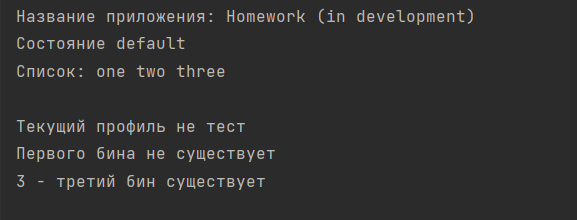
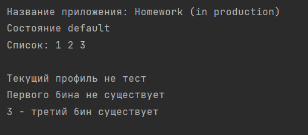

Работа 4

Создать 3 профиля - dev, test, prod, каждый из которых будет включать в себя: 1.1) конфиг с листом из нескольких значений 1.2) название приложения 1.3) конфиг с переменной окружения, по дефолту значение - default

3 бина: 2.1) один создается, только если профиль test, 2.3) другой, если существует первый бин, 2.3) третий, если в конфиге с не “default” (тут в идеале со скриншотом)

Вывод с профилем test

Вывод с профилем dev

Вывод с профилем prod

