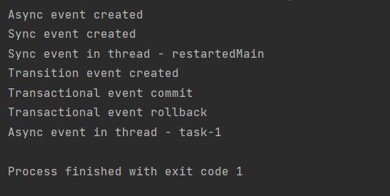

5 работа

Создать три EventListener’a (обычный, Async и Transactional)
Для каждого из них порождать событие 2.1) Для TransactionalEventListener порождать два события так, чтобы одно обрабатывалось, а другое нет
Логировать моменты порождения и обработки событий

Работа приложения

создаются события, обычное и транзакция в restartedMain, асинхронное в task-1, дранзакцию подтверждают и отменяют.